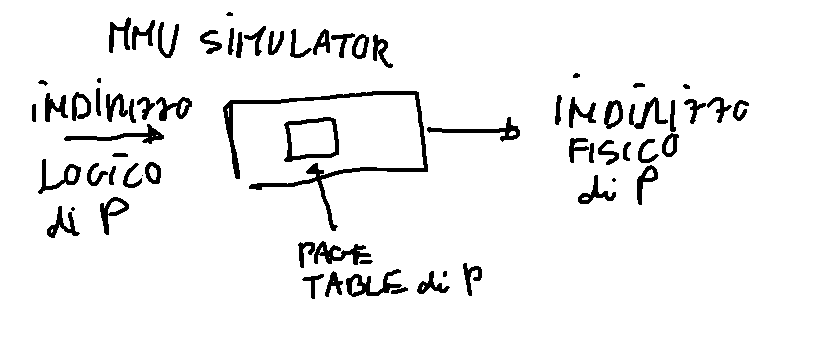

# MMU Simulator

Abbiamo uno spazio di indirizzamento di 16 bit con pagine di 4K. 

Essendo la dimensione della memoria di 64K ( 2^16) abbiamo lo spazio di memoria logica diviso in 16 pagine (= 64K/4K).

Scrivere un programma in C, ad esempio chiamato calcola_indirizzi_fisici, che simula il lavoro svolto del gestore della memoria del SO che trasforma tramite la tabella delle pagine l'indirizzo logico in indirizzo fisico di memoria.

Il programma di simulazione della memoria all'inizio per inizializzarsi  chiede:

quante pagine occupa il programma che il simulatore gestirà;

vi permette di inserire la corrispondenza tra numero di pagina e frame (N° frame pagine 0: .... poi N° frame pagina 1: ....., ecc );

Controlla anche che due pagine non corrispondano per errore allo stesso frame ad esempio.

Vi chiede di inserire l'indirizzo logico (con messaggio di errore se l'indirizzo logico supera il numero di pagine del processo - ad esempio se avete detto che il vostro processo occupa 3 pagine non posso dargli in input un indirizzo logico IL >= 3 * 4K - 1 = 3 * 4 * 1024 - 1) e calcolare il corrispettivo indirizzo fisico come numero decimale e come sequenza di bit dell'indirizzo. Tutto questo mettetelo in un ciclo con la possibilità di fare più conversioni da indirizzo logico a indirizzo fisico. Per fare terminare il programma inserite la stringa quit ad esempio al posto dell'indirizzo.

## ESEMPIO INPUT/OUTPUT PROGRAMMA
Nella prima riga viene mandato in esecuzione il programma calcola_indirizzi_fisici, il seguito sono messaggi di input/output (dove c'è .... è l'input dell'utente):

```

./calcola_indirizzi_fisici
​
Quante pagine occupa il programma da eseguire: ..4..
​
Inserisci in numero frame pagina 0: ..10..
Inserisci il numero frame pagina 1: ...7..
Inserisci il numero frame pagina 2: ...9..
Inserisci il numero frame pagina 3: ...5..
​
OK inizializzata tabella delle pagine!
​
Inserisci indirizzo logico: ..6248..
​
--> OUPUT
​
INDIRIZZO LOGICO, BIT INDIRIZZO:
​
0001_1000_0110_1000
​
INDIRIZZO FISICO, BIT INDIRIZZO:
​
0111_1000_0110_1000
​
VALORE DECIMALE: 30824
​
----------------------------------------
​
Inserisci indirizzo logico: ..quit..

```
​
Il programma può essere visto quindi come un simulatore del lavoro che fa l'MMU per un singolo processo: dato un indirizzo logico lo converte nell'indirizzo fisico in base alla page table del processo.



## IMPLEMENTAZIONE in NODEJS

Algoritmo implementato in nodejs

`node mmu_simulator.js`

